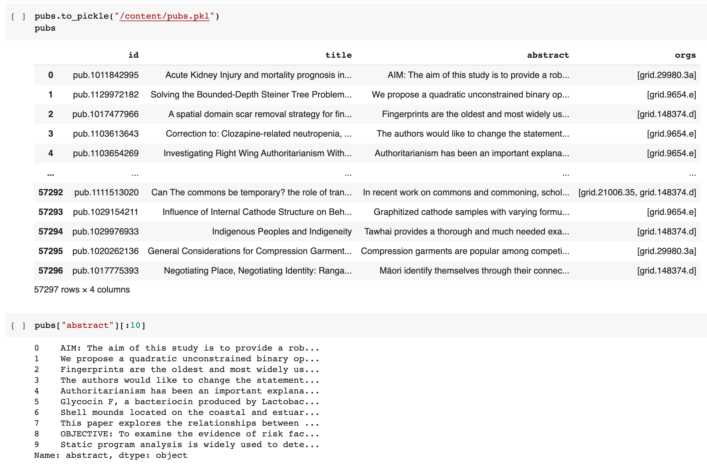
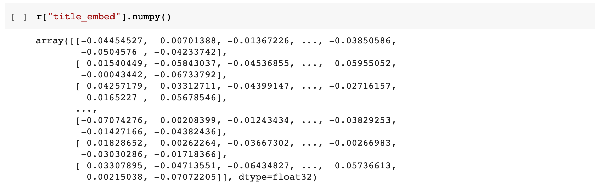
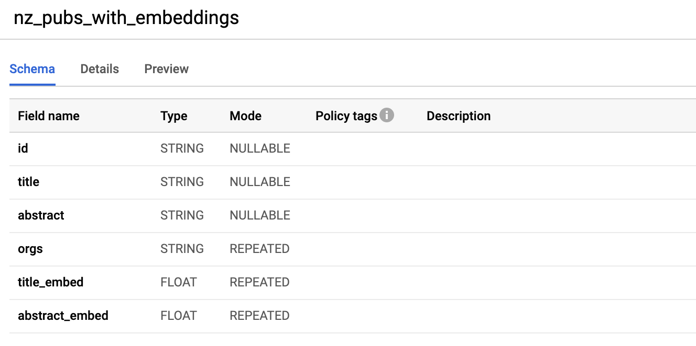
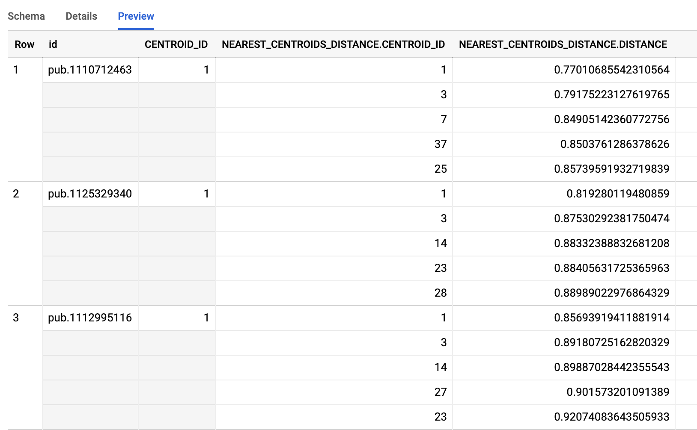
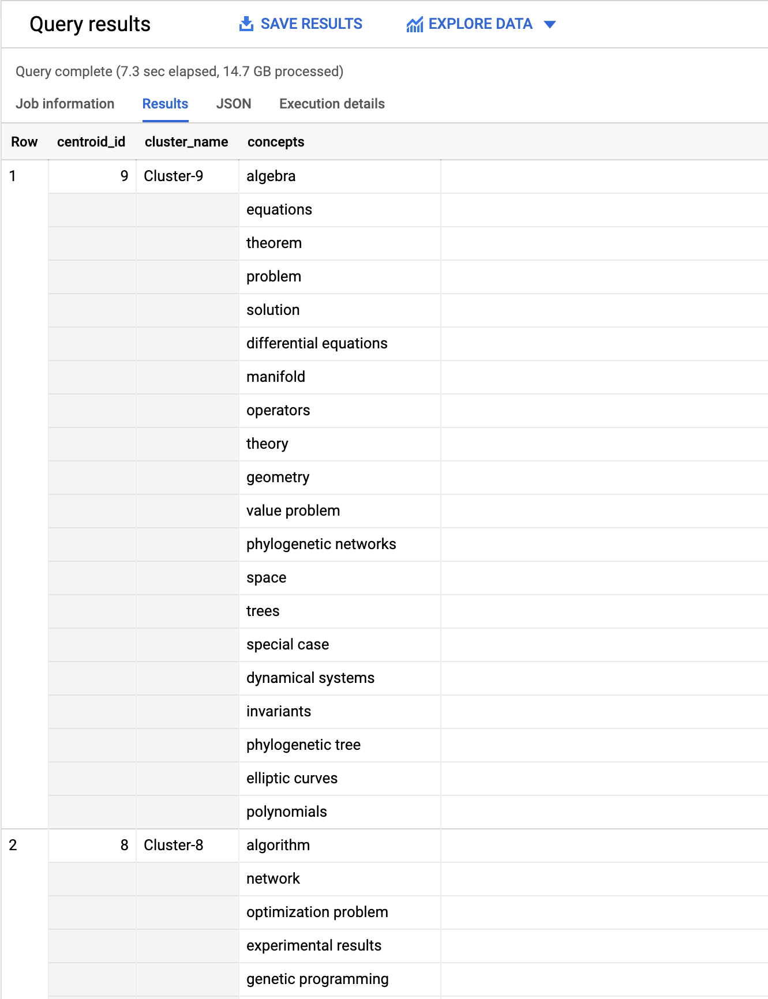

# Basic Topic Clustering using TensorFlow and BigQuery ML

In this tutorial we will implement a basic topic clustering on publications, generating text embeddings using a pre-trained TensorFlow model and creating the groupings via K-means clustering provided by BigQuery ML. This tutorial utilises datasets which are only available to Dimensions on BigQuery customers.

For this specific example we will be analysing the publications of New Zealand’s top 8 universities from 2016 onwards. The example below is based around using a Python Notebook which utilises BigQuery iPython magic commands to execute BigQuery SQL statements.

The basic steps taken are:

* Setup the Python environment and BigQuery access.
* Extract titles/abstracts for the publications of interest from Big Query.
* Use TensorFlow to generate word embeddings from the titles/abstracts.
* Export these embedding vectors back into Google BigQuery and cleanup the format of them.
* Create k-means models using BigQuery ML (multiple models for different cluster counts).
* Compare the different k-means models and select the most appropriate.
* Associate publications back to each cluster.
* Determine the topics/concepts associated with each cluster.

!!! warning "Prerequisites"
    In order to run this tutorial, please ensure that:

    * You have a valid [Dimensions on Google BigQuery account](https://www.dimensions.ai/products/bigquery/) and have [configured a Google Cloud project](https://docs.dimensions.ai/bigquery/gcp-setup.html#).
    * You have some basic familiarity with Python and [Jupyter notebooks](https://jupyter.org/).


## 1. Setup Google BigQuery access

The initial setup is to authenticate your Google Account for accessing GCP resources. This account must be the account which has access to the Dimensions BigQuery datasets. It must also must be allowed to execute and pay for Google BigQuery queries. In the code example below `project_id` should be replaced with the GCP project identifier which you own or can access BigQuery resources on.

```python
from google.colab import auth
auth.authenticate_user()
project_id = "my-gbq-project"  # replace with GCP project to bill against
%load_ext google.cloud.bigquery
```

The project referenced in the examples below is `my-gbq-project`, anytime that is contained within Python code or SQL statements it should be replaced with your own projects identifier. The SQL and Python code below also assumes that two datasets exist within the Google BigQuery project (`project_id`).

* `temp` which holds intermediate tables created during the setup phase.

* `clustering` which holds the tables we will create models from and the final models we create.


## 2. Gather titles/abstracts for publications

The first step we will undertake is building a [DataFrame](https://pandas.pydata.org/pandas-docs/stable/user_guide/dsintro.html#dataframe) which contains the titles and abstracts from publications. We will use the following BigQuery SQL statement to extract the data:

```sql
WITH target_orgs AS (
  SELECT org FROM UNNEST([
    "grid.252547.3", -- AUT
    "grid.9654.e", -- UoA
    "grid.21006.35", -- Canterbury
    "grid.29980.3a", -- Otago
    "grid.267827.e", -- Vic
    "grid.148374.d", -- Massey
    "grid.49481.30", -- Waikato
    "grid.16488.33" -- Lincoln
  ]) org
)
SELECT
  id, ANY_VALUE(title) as title, ANY_VALUE(abstract) as abstract, ARRAY_AGG(org) as orgs
FROM (
  SELECT
    id, title.preferred as title, abstract.preferred as abstract, org as org
  FROM `dimensions-ai.data_analytics.publications` p
  CROSS JOIN UNNEST(research_orgs) org
  RIGHT JOIN target_orgs t ON t.org = org
  WHERE p.year > 2015 AND abstract.preferred is not null
)
GROUP BY id
```

To execute the SQL statement above and save the results into a DataFrame we can use the BigQuery iPython magic command:

```python
%%bigquery --params $bq_params --project $project_id pubs
# SQL statement from above
```

Taking a look at the generated DataFrame we can see what is present and verify that the data matches our expectations. At this point is may also be useful to save the data off to a “pickle” file allowing quick reloading of the dataset and skipping this step in the future when re-running the steps below.




## 3. Generate word embeddings for each publication

The next stage is to generate word embeddings for each publication’s title and abstract. Word embedding models attempt to map words or phrases from a vocabulary into to vectors of real numbers. These word embeddings can then used in language modelling and feature learning natural language processing (NLP) techniques. Ideally, the end result is that publications with abstracts representing the same topics and concepts will be near one another within the reduced vector space generated through the word embedding process.

For this example we will use TensorFlow and the [Universal Sentence Encoder](https://tfhub.dev/google/universal-sentence-encoder/4) model to generate our word embeddings. The input into the model is variable length English text and it will generate a 512 dimensional vector. The embeddings should result in a vector representation which provides a reasonable approximation to semantic similarity between publications based on the content of the abstracts.

```python
import tensorflow as tf
import tensorflow_hub as hub

embed = hub.load("https://tfhub.dev/google/universal-sentence-encoder/4")

def get_embed_title(titles):
    return embed(titles)

def get_embed_abstract(abstracts, delimiter="\n"):
    def _map_fn(a):
        t = tf.cast(a, tf.string)
        t = tf.strings.split(t, sep=delimiter)
        e = embed(t)
        e = tf.reduce_mean(e, axis=0)
        return tf.squeeze(e)
    return tf.map_fn(_map_fn, abstracts, dtype=tf.float32)

def process(titles, abstracts):
    title_embed = get_embed_title(titles)
    abstract_embed = get_embed_abstract(abstracts)

    output_features = {
        'title_embed': title_embed,
        'abstract_embed': abstract_embed,
    }
    return output_features


r = process(pubs["title"], pubs["abstract"])
```

!!! note "Note"
    The `hub.load` function execution may take a little while on the first run as it needs to download the USE model files.

Taking a look at the generated embeddings, we can see that for each publication we have created two arrays of floating point values each 512 items long. The next step is to save these back into a temporary table in BigQuery so that we can apply k-means clustering to attempt to find groups of semantic similar publications.




## 4. Save embedding vectors to a BigQuery table

The next stage is to save the generated title and abstract embedding vectors back into a BigQuery table.

```python
new_pubs = pubs.copy()
table_name = "temp.semantic_clustering"

# Insert into the new DataFrame columns for title and abstract embeddings.
new_pubs["title_embed"] = r["title_embed"].numpy().tolist()
new_pubs["abstract_embed"] = r["abstract_embed"].numpy().tolist()

# Save the DataFrame to a pickle file and into a BigQuery table.
new_pubs.to_pickle("/content/new_pubs.pkl")
new_pubs.to_gbq(table_name, project_id, chunksize=2500)
```

One issue with the imported data is that the vectors for the embeddings is a string rather than a field containing repeated floating-point values. The SQL statement below however creates a new table that converts the string into a proper array of real numbers.

```sql
CREATE OR REPLACE TABLE `my-gbq-project.clustering.nz_pubs_with_embeddings`
AS
SELECT
  id, title, abstract,
  REGEXP_EXTRACT_ALL(orgs, r"\'([^\s,\']+)\'") as orgs,
  (
    SELECT ARRAY_AGG(CAST(v as FLOAT64) ORDER BY o asc)
    FROM UNNEST(SPLIT(REGEXP_EXTRACT(title_embed, r"^\[(.*)\]$"), ", ")) v WITH OFFSET o
  ) AS title_embed,
  (
    SELECT ARRAY_AGG(CAST(v as FLOAT64) ORDER BY o asc)
    FROM UNNEST(SPLIT(REGEXP_EXTRACT(abstract_embed, r"^\[(.*)\]$"), ", ")) v WITH OFFSET o
  ) AS abstract_embed
FROM `my-gbq-project.temp.semantic_clustering`
```

Taking a look at the table within Google BigQuery (web interface) we can see the schema. It contains `title_embed` and `abstract_embed` both of which are **repeated** fields of **FLOAT** type.




## 5. Create k-means cluster models

!!! warning "Warning"
    The example BigQuery SQL statement below use BigQuery ML which has a different charging model when it comes to creating models. Please keep this in mind and approximate how much it could potentially cost before executing any of the SQL statements. Pricing details are available from Google here: [BigQuery ML Pricing](https://cloud.google.com/bigquery-ml/pricing).

The most time consuming and computationally expensive part of this example is the clustering process itself. Luckily we can utilise [BigQuery ML](https://cloud.google.com/bigquery-ml/docs) to create the models and create the clusters of publications based on the word embeddings we have created previously.

In this example we will use [k-means clustering](https://en.wikipedia.org/wiki/K-means_clustering) to attempt to assign each publication to a grouping of semantically similar publications (based on abstracts). Essentially k-means clustering attempts to partition the individual items using Euclidean distance as the metric and minimising the within cluster sum of squares (ie. minimise squared errors).

The primary input parameter that controls the k-means models is the number of partitions (ie. how many clusters we want to partition into). We can use some crude hyper-parameter tuning through creating numerous k-means models on our dataset, attempting to determine what a “good” number of clusters may look like for our set of data. It is important to understand however that because of the approach k-means clustering utilises when assigning items to partitions it is important to analysis the results as a local minimums are a possibility.

```sql
DECLARE NUM_CLUSTERS INT64 DEFAULT 10;
DECLARE MODEL_NAME STRING;

WHILE NUM_CLUSTERS < 60 DO
SET MODEL_NAME = CONCAT('my-gbq-project.clustering.model_nz_pubs_',
                            CAST(NUM_CLUSTERS AS STRING));
EXECUTE IMMEDIATE format("""
CREATE OR REPLACE MODEL `%s`
OPTIONS(model_type='kmeans',
        num_clusters = %d,
        DISTANCE_TYPE = 'cosine',
        kmeans_init_method = 'KMEANS++') AS
WITH data AS (
  SELECT
    abstract_embed[OFFSET(0)] as abstract0,
    abstract_embed[OFFSET(1)] as abstract1,
    abstract_embed[OFFSET(2)] as abstract2,
    abstract_embed[OFFSET(3)] as abstract3,
    abstract_embed[OFFSET(4)] as abstract4,
    abstract_embed[OFFSET(5)] as abstract5,
    abstract_embed[OFFSET(6)] as abstract6,
    abstract_embed[OFFSET(7)] as abstract7,
...
    abstract_embed[OFFSET(510)] as abstract510,
    abstract_embed[OFFSET(511)] as abstract511
  FROM `my-gbq-project.clustering.nz_pubs_with_embeddings`
)
SELECT * FROM data;
""", MODEL_NAME, NUM_CLUSTERS);

SET NUM_CLUSTERS = NUM_CLUSTERS + 5;
END WHILE
```

!!! note "Note"
    The SQL statement above has been truncated. The `abstract_embed[OFFSET(n)] as abstract_n` lines have been omitted and goes from 0 to 511 uninterrupted and has been abbreviated for the purposes of brevity in the tutorial write-up. The full SQL is available [here](https://docs.dimensions.ai/bigquery/_static/downloads/clustering-tutorial/5-create-models.sql).

Creating the models may take a little while as it must apply the k-means algorithm over our dataset for each of the different cluster count parameter values. The next step is to analyse the results for all of the models created. We can evaluate each of the models, returning the [Davies–Bouldin index](https://en.wikipedia.org/wiki/Davies%E2%80%93Bouldin_index) and the mean squared distance. Determining the optimal number of clusters is outside the scope of this tutorial, however a common approach is using the [“Elbow method”](https://en.wikipedia.org/wiki/Elbow_method_(clustering)).

```sql
#StandardSQL
SELECT 60 as cluster_size, * FROM ML.EVALUATE(MODEL `my-gbq-project.clustering.model_nz_pubs_60`)
UNION ALL
SELECT 55 as cluster_size, * FROM ML.EVALUATE(MODEL `my-gbq-project.clustering.model_nz_pubs_55`)
UNION ALL
SELECT 50 as cluster_size, * FROM ML.EVALUATE(MODEL `my-gbq-project.clustering.model_nz_pubs_50`)
UNION ALL
SELECT 45 as cluster_size, * FROM ML.EVALUATE(MODEL `my-gbq-project.clustering.model_nz_pubs_45`)
UNION ALL
SELECT 40 as cluster_size, * FROM ML.EVALUATE(MODEL `my-gbq-project.clustering.model_nz_pubs_40`)
UNION ALL
SELECT 35 as cluster_size, * FROM ML.EVALUATE(MODEL `my-gbq-project.clustering.model_nz_pubs_35`)
UNION ALL
SELECT 30 as cluster_size, * FROM ML.EVALUATE(MODEL `my-gbq-project.clustering.model_nz_pubs_30`)
UNION ALL
SELECT 25 as cluster_size, * FROM ML.EVALUATE(MODEL `my-gbq-project.clustering.model_nz_pubs_25`)
UNION ALL
SELECT 20 as cluster_size, * FROM ML.EVALUATE(MODEL `my-gbq-project.clustering.model_nz_pubs_20`)
UNION ALL
SELECT 15 as cluster_size, * FROM ML.EVALUATE(MODEL `my-gbq-project.clustering.model_nz_pubs_15`)
UNION ALL
SELECT 10 as cluster_size, * FROM ML.EVALUATE(MODEL `my-gbq-project.clustering.model_nz_pubs_10`)
```


## 6. Publication to cluster assignment

Using k=55 (`my-gbq-project.clustering.model_nz_pubs_55`) as the cluster count from above we can now use the k-means model we created in BigQuery to determine which publications are assigned to each different centroid (cluster). Note below that the input data into the model matches the data structure that was used during the creation of the model itself (the abstracts embedding vector exploded into 512 individual string inputs).

```sql
CREATE TABLE `my-gbq-project.clustering.pubs_assigned_55`
AS

WITH data AS (
  SELECT
    id,
    abstract_embed[OFFSET(0)] as abstract0,
    abstract_embed[OFFSET(1)] as abstract1,
    abstract_embed[OFFSET(2)] as abstract2,
    ...
    abstract_embed[OFFSET(510)] as abstract510,
    abstract_embed[OFFSET(511)] as abstract511
  FROM `my-gbq-project.clustering.nz_pubs_with_embeddings`
)

SELECT id, CENTROID_ID, NEAREST_CENTROIDS_DISTANCE FROM
ML.PREDICT(MODEL `my-gbq-project.clustering.model_nz_pubs_55`,
(
    SELECT * FROM data
))
```

Taking a look at the resultant table we see that each publication has been assigned to a primary cluster (centroid identifier) as well as a listing of the closest centroids as well as the Euclidean distance to the centroid.




## 7. Determine concepts/topics for each cluster

The next stage is to try and determine the topics and concepts associated with each of the 55 clusters identified within the assigned publications above. Some publications have concepts extracted via NLP processing of the full-text. One approach to determining the concepts associated with each cluster is to aggregate these extracted concepts from for all publications within the same cluster.

```sql
SELECT
    ANY_VALUE(centroid) as centroid_id,
    cluster_id as cluster_name,
    ARRAY_AGG(concept order by ordering) as concepts
FROM (
    SELECT * FROM (
      SELECT *, ROW_NUMBER() OVER (PARTITION BY cluster_id ORDER BY count desc) as ordering
      FROM (
        SELECT ANY_VALUE(centroid) as centroid, a.cluster_id as cluster_id, concept, COUNT(*) as count
        FROM (
          SELECT
            a.id,
            a.CENTROID_ID as centroid,
            CONCAT("Cluster-", CAST(a.CENTROID_ID as STRING)) as cluster_id,
            (SELECT ARRAY_AGG(LOWER(c.concept)) FROM UNNEST(p.concepts) c) as concetps
          FROM `my-gbq-project.clustering.pubs_assigned_55` a
          LEFT JOIN `dimensions-ai.data_analytics.publications` p
            ON p.id = a.id
        ) a, UNNEST(a.concetps) concept
        GROUP BY a.cluster_id, concept
      )
      ORDER BY cluster_id desc, ordering asc
    )
    WHERE ordering <= 20
)
GROUP BY cluster_id
```

Taking a look at the results we can see for each centroid the 20 top concepts (by occurrence over all publications).


