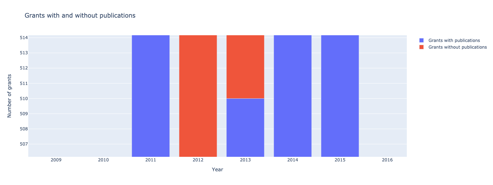

#  Identify a funder's grants and publications

### Use case

How many grants have resulted in publications? This notebook serves two main purposes:

i. Enables identification of a funder's grants and resulting publications.

ii. Prepares a summary table of grants and publications (per year and in total), and a bar graph showing number of grants by year with and without publications.

!!! warning "Prerequisites"
    In order to run this tutorial, please ensure that:

    * You have a valid [Dimensions on Google BigQuery account](https://www.dimensions.ai/products/bigquery/) and have [configured a Google Cloud project](https://docs.dimensions.ai/bigquery/gcp-setup.html#).
    * You have a valid [Dimensions API account](https://docs.dimensions.ai/dsl/).
    * You have some basic familiarity with Python and [Jupyter notebooks](https://jupyter.org/).

This tutorial is based on a Jupyter notebook that is [available directly via GitHub](https://github.com/digital-science/dimensions-gbq-lab/blob/f1ed0d3f46517a32711a0a5b295d074a3d0fa02b/archive/6-funder_grant_pubs.ipynb).

### Method

This notebook retrieves grants and publication data from Dimensions the world's largest linked research information dataset. For more about Dimensions visit - https://www.dimensions.ai/

To complete this analysis the following steps are taken:

1. Connect to the Dimensions database.
1. Find funder's unique GRID ID. The Global Research Identifier Database (GRID) is a database of research-related organisations each with a unique and persistent identifier. For more about GRID visit - https://grid.ac/.
1. Generate list of grants and resulting publications.
1. (OPTIONAL) Export list of grants and resulting publications to excel.
1. Summary table showing number of grants and publications in total and by year.
1. Graph showing number of grants that have yielded one or more publications by year.

### Using this notebook
Before running some cells you will have to fill in information about the funder and year range. When required instructions are set out in info boxes.

This notebook assumes installation of python packages `pandas` and `plotly`.

### 1. Connect to Dimensions

You will need to be authenticated to run these queries—see the ["Verifying your connection](01-connection.md) tutorial for options.

Run this cell if you're connecting via a Google Colab notebook:

```python
from google.colab import auth
auth.authenticate_user()
print('Authenticated')
```

    Authenticated

```python
import pandas as pd
from google.cloud import bigquery

GBQ_PROJECT_ID = 'ds-gov-funder-gbq' # <----- Input your project ID here
client = bigquery.Client(project=GBQ_PROJECT_ID)
```

### 2. Find funder's unique GRID ID
To identify funder's grants we need the funder's unique GRID ID. The following cell searches on the funders names and returns the associated GRID ID(s).

!!! example "Instructions"
    1. Before running the code in the following cell input funder's name
    1. Funder's name might return multiple GRID IDs, note all relevant GRID IDs as they are needed for the next step.

If no GRID IDs are returned, try searching different name variants for the funder. Avoid acronyms.


```python
funder_name = 'Wellcome Trust' # Input funder name here

funder_name = funder_name.lower()
query = f"""
    select
        id as grid_id
        , name
    from `dimensions-ai.data_analytics.grid`
    where lower(name) like '%{funder_name}%'
"""

funder = pd.read_gbq(query, project_id=GBQ_PROJECT_ID)
funder.head(10)
```

<table>
  <thead>
    <tr>
      <th>Row</th>
      <th>grid_id</th>
      <th>name</th>
    </tr>
  </thead>
  <tbody>
    <tr>
      <td>0</td>
      <td>grid.52788.30</td>
      <td>Wellcome Trust</td>
    </tr>
    <tr>
      <td>1</td>
      <td>grid.478079.5</td>
      <td>NIHR Wellcome Trust Southampton Clinical Resea...</td>
    </tr>
    <tr>
      <td>2</td>
      <td>grid.484745.e</td>
      <td>Wellcome Trust/DBT India Alliance</td>
    </tr>
    <tr>
      <td>3</td>
      <td>grid.482844.6</td>
      <td>Wellcome Trust Centre for the History of Medicine</td>
    </tr>
    <tr>
      <td>4</td>
      <td>grid.419393.5</td>
      <td>Malawi-Liverpool-Wellcome Trust Clinical Resea...</td>
    </tr>
  </tbody>
</table>

### 3. Generate list of grants and publications identifiers

The following cell generates a table of funders grants and any resulting publications for grants started in a defined time period. Only the first five rows of the table will be shown in this notebook, however the whole table can be exported to excel in the following step.

Table columns:

* `dimensions_grant_id` - Unique identifier for grant in Dimensions
* `grant_start_year` - Year the grant started
* `grant_number` - Grant number used by funder
* `dimensions_publication_id` - Unique identifier for publications in Dimensions
* `doi` - Digital Object Identifier

!!! example "Instructions"
    Before running the code in the following cell, where indicated:

    1. input funders GRID ID between `('')` e.g. `('grid.52788.30')`. If funder has two or more GRID IDs then list within brackets separated by commas e.g. `('grid.453157.1', 'grid.453157.1')`.
    1. Update year range, note that we can only look at full years and cannot be filtered by month or day.

```python
query = f"""
with pubs as
  (select id, doi from `dimensions-ai.data_analytics.publications`)
, grants as
  (
  select
    id as dimensions_grant_id
    , start_year as grant_start_year
    , grant_number
    , pub_id as dimensions_publication_id
  from `dimensions-ai.data_analytics.grants` g left join unnest(g.resulting_publication_ids) as pub_id
   where funder_org in ('grid.52788.30')  -- ADD GRID ID HERE
      and start_year between 2011 and 2015 -- UPDATE YEAR RANGE
    )
Select
  grants.*
  , pubs.doi
from grants
  left join pubs
    on pubs.id = grants.dimensions_publication_id
"""
grants = pd.read_gbq(query)
grants.head()
```

<table>
  <thead>
    <tr>
      <th>Row</th>
      <th>dimensions_grant_id</th>
      <th>grant_start_year</th>
      <th>grant_number</th>
      <th>dimensions_publication_id</th>
      <th>doi</th>
    </tr>
  </thead>
  <tbody>
    <tr>
      <td>0</td>
      <td>grant.3627143</td>
      <td>2012</td>
      <td>082265/Z/07/A</td>
      <td>pub.1105902779</td>
      <td>10.1016/j.jaci.2018.07.011</td>
    </tr>
    <tr>
      <td>1</td>
      <td>grant.3635772</td>
      <td>2012</td>
      <td>098274/Z/12/Z</td>
      <td>pub.1124346329</td>
      <td>10.1016/j.bpj.2020.01.019</td>
    </tr>
    <tr>
      <td>2</td>
      <td>grant.3636003</td>
      <td>2012</td>
      <td>097899/Z/11/Z</td>
      <td>pub.1062809971</td>
      <td>10.1016/j.jaci.2018.07.011</td>
    </tr>
    <tr>
      <td>3</td>
      <td>grant.3642390</td>
      <td>2012</td>
      <td>098649/Z/12/Z</td>
      <td>None</td>
      <td>None</td>
    </tr>
    <tr>
      <td>4</td>
      <td>grant.3638982</td>
      <td>2012</td>
      <td>099618/Z/12/Z</td>
      <td>pub.1023307051</td>
      <td>10.1007/s00234-016-1648-3</td>
    </tr>
  </tbody>
</table>

### 4. (OPTIONAL) Export list of grants and resulting publications to excel
The following cell creates new excel file of grants and resulting publications as output from previous cell. The new file will appear in the same location as this notebook is saved.

!!! example "Instructions"
    Before running code the code in the following cell replace `FILE_NAME` with new file name.

```python
# Creates new excel file.
writer = pd.ExcelWriter('FILE_NAME.xlsx',  engine='openpyxl')

grants.to_excel(writer, sheet_name='grants_pubs')

writer.save()
```

### 5. Summary table of number of grants and publications in total and by year

The following cell creates a table with columns, for all years and per year:

* `grant_start_year` - first year of the grant
* `grants` - number of grants awarded by funder
* `publications` - number of publications resulting from awards by funder
* `grants_without_publications` - number of grants that have not resulted in a publication
* `perc_without_publications` - percentage of grants that have not resulted in a publication
* `avg_publications_per_grants` - average (mean) number of publications per grant

!!! example "Instructions"
    Before running code the code in the following cell, where indicated:

    1. input funders GRID ID between `('')` e.g. `('grid.52788.30')`. If funder has two or more GRID IDs then list within brackets separated by commas e.g. `('grid.453157.1', 'grid.453157.1')`.
    1. Update year range

```python
query = f"""
with grant_pub_map as
  (
  select
    id
    , start_year
   , pub_id  -- is this the best way of finding publications? or search for grant or
  from `dimensions-ai.data_analytics.grants` g left join unnest(g.resulting_publication_ids) as pub_id
    where funder_org = 'grid.52788.30'  -- ADD GRID IDs HERE
      and start_year between 2011 and 2015 -- UPDATE YEAR RANGE
  )
select
  'All years' as grant_start_year
  , count(distinct id) as grants
  , count(pub_id) as publications
  , countif(pub_id is null) as grants_without_publications
  , round(((countif(pub_id is null)/count(distinct id))*100), 2) as perc_without_publications
  , round((count(pub_id)/(count(distinct id) )),2) as avg_publications_per_grants
from grant_pub_map
 union all
select
  cast(start_year as string) as grant_start_year
  , count(distinct id) as grants
  , count(pub_id) as publications
  , countif(pub_id is null) as grants_without_publications
  , round(((countif(pub_id is null)/count(distinct id))*100), 2) as perc_without_publications
  , round((count(pub_id)/(count(distinct id) )),2) as avg_publications_per_grants
from grant_pub_map
  group by start_year
order by 1 desc ;
"""

grants1 = pd.read_gbq(query)
grants1.head(5)
```

<table>
  <thead>
    <tr>
      <th>Row</th>
      <th>grant_start_year</th>
      <th>grants</th>
      <th>publications</th>
      <th>grants_without_publications</th>
      <th>perc_without_publications</th>
      <th>avg_publications_per_grants</th>
    </tr>
  </thead>
  <tbody>
    <tr>
      <td>0</td>
      <td>All years</td>
      <td>6423</td>
      <td>45840</td>
      <td>3731</td>
      <td>58.09</td>
      <td>7.14</td>
    </tr>
    <tr>
      <td>1</td>
      <td>2015</td>
      <td>1417</td>
      <td>6901</td>
      <td>833</td>
      <td>58.79</td>
      <td>4.87</td>
    </tr>
    <tr>
      <td>2</td>
      <td>2014</td>
      <td>1327</td>
      <td>8746</td>
      <td>791</td>
      <td>59.61</td>
      <td>6.59</td>
    </tr>
    <tr>
      <td>3</td>
      <td>2013</td>
      <td>1200</td>
      <td>8217</td>
      <td>690</td>
      <td>57.50</td>
      <td>6.85</td>
    </tr>
    <tr>
      <td>4</td>
      <td>2012</td>
      <td>1159</td>
      <td>8515</td>
      <td>689</td>
      <td>59.45</td>
      <td>7.35</td>
    </tr>
  </tbody>
</table>

### 6. Bar graph showing number of grants that have yielded one or more publications by year

Using the table above the following cell generates a bar graph showing the number of grants with and without publications per year.


```python
# Remove first row that counts all grants over all years
df = grants1.iloc[1:]

# Reverse rows so earlist year shown first on bar graph
df = df[::-1].reset_index()

# Calculate number of grants with publications
df.insert(5, 'grant_pubs', df["grants"] - df["grants_without_publications"])


import plotly.graph_objs as go


x = df.grant_start_year

trace1 = {
    'x' : x,
    'y' : df.grant_pubs,
    'name' : 'Grants with publications',
    'type' : 'bar'
};
trace2 = {
    'x' : x,
    'y' : df.grants_without_publications,
    'name' : 'Grants without publications',
    'type' : 'bar'
};
data = [trace1, trace2];
layout = {
    'xaxis' : {'title' : 'Year'},
    'yaxis' : {'title' : 'Number of grants'},
    'barmode' : 'relative',
    'title': 'Grants with and without publications'
};
fig = go.Figure(data = data, layout = layout)
fig.show()
```


